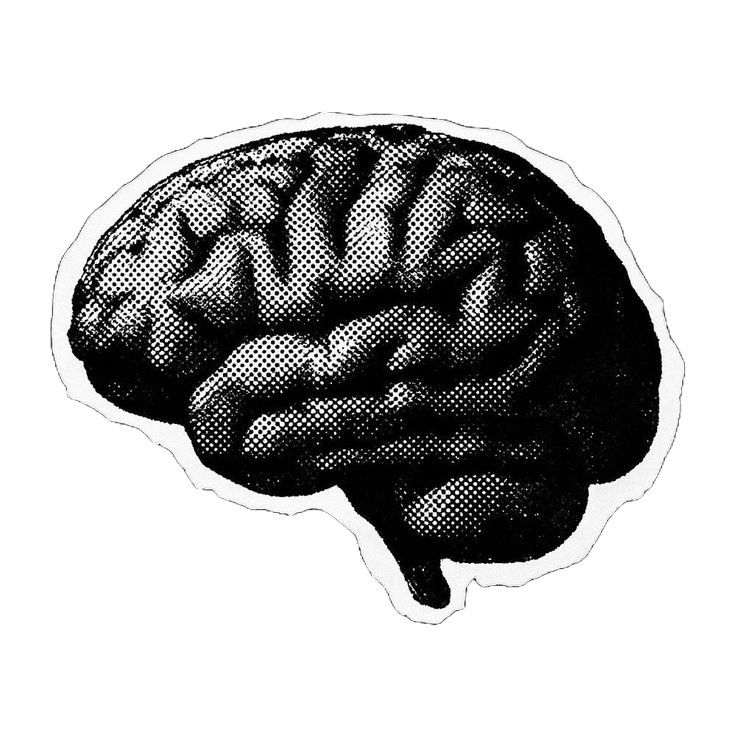
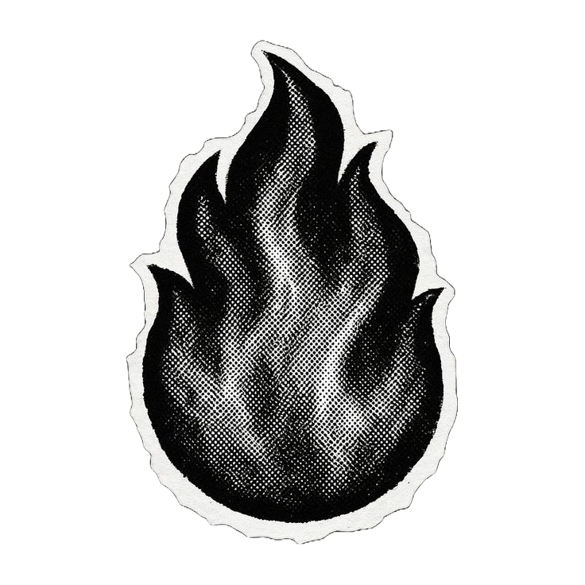

  

 

<h3 align="center">Know About Me</h3>

 

**Hey there! I'm Attaullah**

Math & Computing student at BIT Mesra. I like building backend systems, working close to the metal, and breaking open source codebases I probably shouldn't touch. GSoC '26 contributor with the Linux Foundation, open source contributor to CGAL and the NetBSD kernel, and a competitive programmer who takes Codeforces ratings a bit too seriously.

 

<h3 align="center">Top Projects (built to avoid manual labor)</h3>

 

 &nbsp; A cloud-native API Gateway built from scratch in Go, because some traffic needs to self-destruct gracefully.  

 &nbsp; A userspace TCP/IP network stack in C. Wrote my own TCP state machine because the Linux kernel was getting too comfortable.  

 &nbsp; A real-time collaborative code editor with sandboxed Docker execution, because writing code alone is boring.  

 

<h3 align="center">Connect</h3>

  
  
  
  <a href="#"> <!-- Add your resume link here -->
    
  </a>

 

> Code is never finished. It only becomes slightly less terrible over time.
> 
> Every commit I make is essentially just a small, desperate apology to my future self. Someday I will return to this codebase, look at the spaghetti I've written, and wonder who let me anywhere near a keyboard.

<h3 align="center">Contribution</h3>

  

